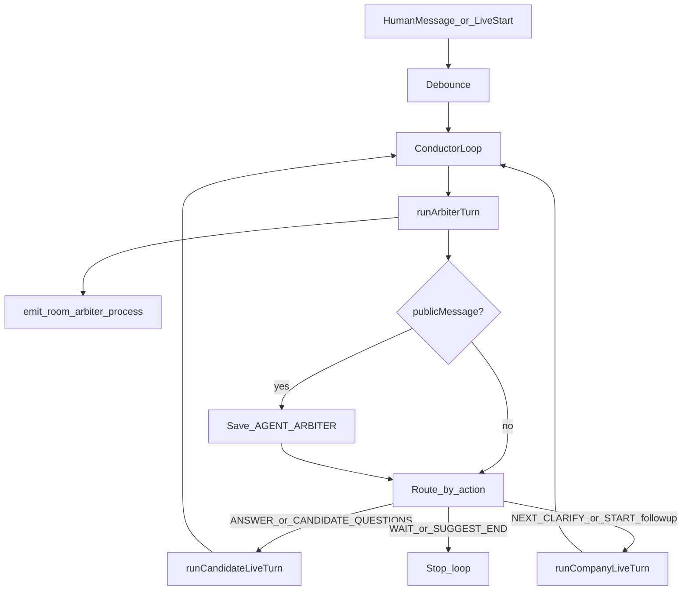

# Arbiter Conductor Implementation Plan

> **For agentic workers:** REQUIRED SUB-SKILL: Use superpowers:subagent-driven-development (recommended) or superpowers:executing-plans. Steps use checkbox syntax in the saved plan file under `docs/superpowers/plans/`.

**Goal:** Прибрати каскад мовчання в live-чаті: Arbiter аналізує хід і диригує Company/Candidate через приховані команди; HR бачить коротку стрічку процесів; кандидат — лише «думає…».

**Architecture:** Arbiter повертає JSON-команду (`action` + `summaryUk` + опційний `briefUk` / `publicMessage`). Orchestrator більше не ганяє завжди Arbiter→Company→Candidate; замість цього крутить **conductor-loop** (з лімітом кроків): Arbiter → лише цільовий агент → знову Arbiter, доки не `WAIT`/`SUGGEST_END` або ліміт. `pendingQuestion` тримається в `RoomState` (без міграції Prisma). HR отримує `room:arbiter-process`.

**Tech stack:** існуючі Node test runner, Socket.IO, Vue 3, Prisma `LiveMessage` (без нових полів).

## Global Constraints

- Усі публічні повідомлення агентів — українською.
- Команди Arbiter не потрапляють у публічний чат (крім `publicMessage` для `START` / `SUGGEST_END`).
- Кандидат не бачить деталей процесів; HR — так.
- Candidate Agent відповідає з профілю; інакше просить живу людину в чаті.
- Без Prisma-міграцій; без HR override-кнопок; без стрімінгу LLM.

## Затверджені рішення (з brainstorming)

- Підхід 1: структуровані команди + selective run + легкий стан.
- Сигнали приховані; HR-панель з `summaryUk`; кандидат — лише thinking.
- Черга: спочатку відповісти на відкрите питання.
- Після відповіді: `NEXT_QUESTION` або `CLARIFY`; теми вичерпано → `CANDIDATE_QUESTIONS`.

## Критичний gap поточного pipeline

Зараз: `Human → debounce → Arbiter → Company → Candidate` і стоп. Arbiter **не бачить** відповідь Candidate у тому ж ході, тому не може дати «наступне питання» без нової репліки людини.

**Рішення:** `executeConductorLoop` з `MAX_CONDUCTOR_STEPS = 6` (кожен крок = 1 LLM-виклик Arbiter або Company/Candidate). Типові біти:



Приклад після старту: `START` (публічно) → Company питання → `ANSWER` → Candidate відповідь → `NEXT_QUESTION` → … доки Arbiter не `WAIT`/`SUGGEST_END` або ліміт.

Скасування: існуючий `generation` — на новому human message loop обривається.

---

## File map

| Area | Files |
|------|--------|
| Spec | Create `docs/superpowers/specs/2026-07-16-arbiter-conductor-design.md` |
| Plan copy | Create `docs/superpowers/plans/2026-07-16-arbiter-conductor.md` (повна копія цього плану з чекбоксами) |
| Arbiter contract | Modify [`backend/src/agents/arbiter-agent.ts`](backend/src/agents/arbiter-agent.ts), [`backend/src/agents/prompts/arbiter-agent.uk.ts`](backend/src/agents/prompts/arbiter-agent.uk.ts), [`backend/src/agents/arbiter-agent.test.ts`](backend/src/agents/arbiter-agent.test.ts) |
| Live agents | Modify [`company-live-agent.ts`](backend/src/agents/company-live-agent.ts), [`candidate-live-agent.ts`](backend/src/agents/candidate-live-agent.ts), їх prompts + tests |
| Orchestrator | Modify [`backend/src/socket/orchestrator.ts`](backend/src/socket/orchestrator.ts), [`orchestrator.test.ts`](backend/src/socket/orchestrator.test.ts), [`backend/src/socket/types.ts`](backend/src/socket/types.ts) |
| Frontend | Modify [`useInterviewRoom.ts`](frontend/src/composables/useInterviewRoom.ts), [`AgentStatusPanel.vue`](frontend/src/components/AgentStatusPanel.vue), [`InterviewRoomContent.vue`](frontend/src/components/InterviewRoomContent.vue) |

`parsePostReply` для Company/Candidate **залишається**; Arbiter отримує окремий парсер.

---

### Task 1: Design spec + plan file

- [ ] Записати затверджений дизайн у `docs/superpowers/specs/2026-07-16-arbiter-conductor-design.md` (pipeline, actions, UI, errors, out of scope, conductor-loop).
- [ ] Зберегти цей план у `docs/superpowers/plans/2026-07-16-arbiter-conductor.md`.
- [ ] Commit: `docs: add arbiter conductor design and plan`.

---

### Task 2: Arbiter command parse + prompt

**Produces:**

```ts
export type ArbiterAction =
  | "START" | "ANSWER" | "NEXT_QUESTION" | "CLARIFY"
  | "CANDIDATE_QUESTIONS" | "WAIT" | "SUGGEST_END";

export type ParsedArbiterCommand = {
  action: ArbiterAction;
  summaryUk: string;
  briefUk?: string;
  publicMessage?: string; // лише START / SUGGEST_END (і рідка модерація)
};
```

- [ ] TDD: тести `parseArbiterCommand` у `arbiter-agent.test.ts` — валідні action, strip fences, порожній `summaryUk` → error, `START` без `publicMessage` → error, невідомий action → error. Старі тести `{post,message}` замінити.
- [ ] Реалізувати `parseArbiterCommand`; `runArbiterTurn` повертає `ParsedArbiterCommand`. Підняти `maxTokens` (наприклад 256).
- [ ] Оновити [`arbiter-agent.uk.ts`](backend/src/agents/prompts/arbiter-agent.uk.ts): диригент, правила черги (`pendingQuestion` передається в user/system nudge), коли який `action`, формат JSON без markdown.
- [ ] `buildArbiterMessages` приймає `{ pendingQuestion: boolean }` і додає короткий системний nudge.
- [ ] Commit: `feat: arbiter returns structured conductor commands`.

---

### Task 3: Company/Candidate turn context

**Produces:** `LiveAgentTurnContext = { action: ArbiterAction; briefUk?: string }`

- [ ] Розширити `runCompanyLiveTurn` / `runCandidateLiveTurn` і `build*Messages` опційним `turnContext`.
- [ ] Оновити промпти: агент викликається лише з командою; майже завжди `post:true` з одним повідомленням; ролі `NEXT_QUESTION` / `CLARIFY` / `ANSWER` / `CANDIDATE_QUESTIONS`; прибрати «чекай сигнал старту в історії» як єдиний гейт (старт тепер через команду після `START`).
- [ ] Candidate: для `ANSWER` — nudge з `briefUk` або дефолт «відповідай на відкрите питання»; для `CANDIDATE_QUESTIONS` — окремий nudge.
- [ ] Тести build messages + run turn з context.
- [ ] Commit: `feat: live agents accept arbiter turn context`.

---

### Task 4: Orchestrator conductor-loop + process event

**Key types** (у [`types.ts`](backend/src/socket/types.ts)):

```ts
export type RoomArbiterProcessEvent = {
  at: string;
  action: string;
  summaryUk: string;
};
```

**RoomState** додати: `pendingQuestion: boolean` (поруч із `debounceTimer` / `generation`).

**Логіка `pendingQuestion`:**
- `true` після збереженого публічного повідомлення Company, або коли Arbiter обрав `ANSWER` / `CLARIFY`.
- `false` на `NEXT_QUESTION` (перед питанням — скинемо після оцінки; після Company post знову `true`), `CANDIDATE_QUESTIONS`, `START`, `SUGGEST_END`, `WAIT` після закриття теми — конкретно: set `true` when Company message saved; set `false` when action is `NEXT_QUESTION` | `CANDIDATE_QUESTIONS` | `SUGGEST_END` | `START` **before** running Company (оцінка закрила попередню відповідь); after Company posts set `true` again; `CLARIFY` keeps expecting answer (`true` after Company posts).

**`executeTurn` → loop:**
1. `runArbiter(interviewId, sessionId)` — потрібно змінити injectable signature щоб передавати `pendingQuestion` **або** читати стан всередині обгортки orchestrator (обгортка передає pending у `defaultRunArbiterTurn` через новий параметр).
2. Emit `room:arbiter-process`.
3. Якщо `publicMessage` — save + emit `room:messages`.
4. Route:
   - `WAIT` / `SUGGEST_END` → break
   - `ANSWER` | `CANDIDATE_QUESTIONS` → Candidate(+context)
   - `NEXT_QUESTION` | `CLARIFY` → Company(+context)
   - `START` → public already posted → Company with `{ action: "NEXT_QUESTION", briefUk }`
5. Перевірка `generation` між кроками; `MAX_CONDUCTOR_STEPS`.
6. Thinking indicator на активного агента кожного кроку.

Оновити injectable типи: `runArbiterTurn` повертає `ParsedArbiterCommand`; `runCompany`/`runCandidate` приймають context (orchestrator передає).

- [ ] Переписати тести orchestrator:
  - `START` → process event + arbiter msg + company called once (mock) + optional second arbiter ANSWER + candidate
  - `ANSWER` only → candidate only, company not called
  - `WAIT` → nobody else
  - cancel mid-loop via generation
  - process event payload shape
- [ ] Зберегти candidate recovery timer behavior лише якщо Candidate step failed after Company posted у цьому loop (адаптувати під нову модель).
- [ ] Commit: `feat: orchestrator conductor loop and arbiter-process events`.

**Сигнатура Arbiter run (зафіксовано):**

```ts
runArbiterTurn(prisma, interviewId, sessionId, provider, { pendingQuestion: boolean })
```

Wiring у `createRoomOrchestrator`: замикання читає `getState(interviewId).pendingQuestion`.

---

### Task 5: Frontend HR process feed

- [ ] У [`useInterviewRoom.ts`](frontend/src/composables/useInterviewRoom.ts): тип `ArbiterProcessEntry`, `arbiterProcessLog` (max 8), слухати `room:arbiter-process` **лише якщо `currentRole === "HR"`** (підписка можна завжди, push лише для HR).
- [ ] [`AgentStatusPanel.vue`](frontend/src/components/AgentStatusPanel.vue): prop `processLog`, список під статусами агентів (`summaryUk` + дрібний час).
- [ ] [`InterviewRoomContent.vue`](frontend/src/components/InterviewRoomContent.vue): передати log у панель (вже `v-if="HR"`).
- [ ] Кандидат: без змін видимості панелі; thinking у чаті як зараз.
- [ ] Commit: `feat: show arbiter process feed for HR`.

---

### Task 6: Verification

- [ ] `cd backend && npm test` (мінімум arbiter, company-live, candidate-live, orchestrator).
- [ ] Ручний сценарій (коротко): LIVE → Arbiter START у чаті + process у HR → Company питання → Candidate відповідь без нового human msg → наступне/уточнення; HR бачить стрічку; кандидат не бачить `summaryUk`.
- [ ] За потреби оновити згадку pipeline в README (короткий абзац про conductor) — лише якщо вже є секція Day 16–18 про ланцюжок.

---

## Self-review vs brainstorming

| Вимога | Task |
|--------|------|
| Приховані команди + HR summary | 2, 4, 5 |
| Кандидат лише thinking | 5 |
| Оцінка → next/clarify | 2, 4 (loop) |
| Спочатку відповісти на питання | 2 nudge + pendingQuestion |
| Вичерпано → питання Candidate | action `CANDIDATE_QUESTIONS` |
| Candidate з профілю / defer human | 3 prompts |
| Без DB state-machine | pending у RoomState |
| Мовчання після старту на human replies | loop після відповіді |

## Поза scope (не робити)

- Кнопки HR override, Prisma fields, повна FSM у БД, зміна Final Report.
